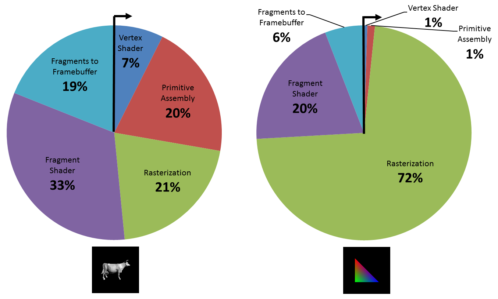
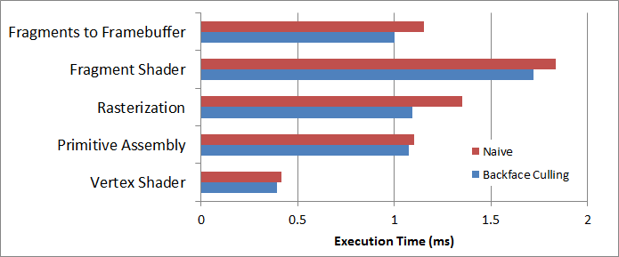

CUDA Rasterizer
===============

Performance
-----------

Execution Time Distribution

Backface Culling Effectiveness

Note: This was for a class at UPenn: CIS565 Project 4 Fall 2013 (Due 10/31/2013)

