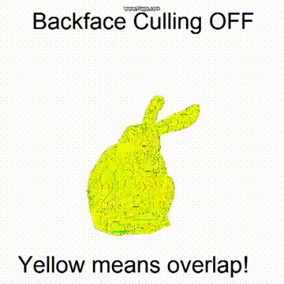
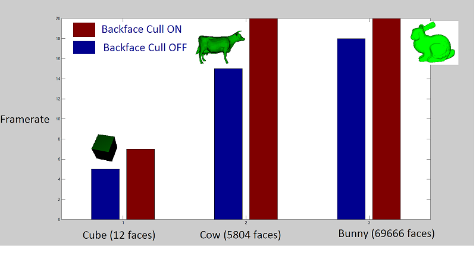
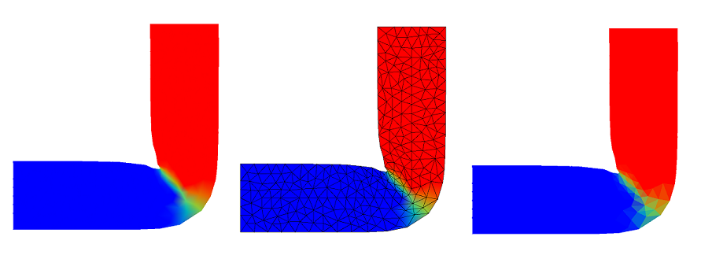
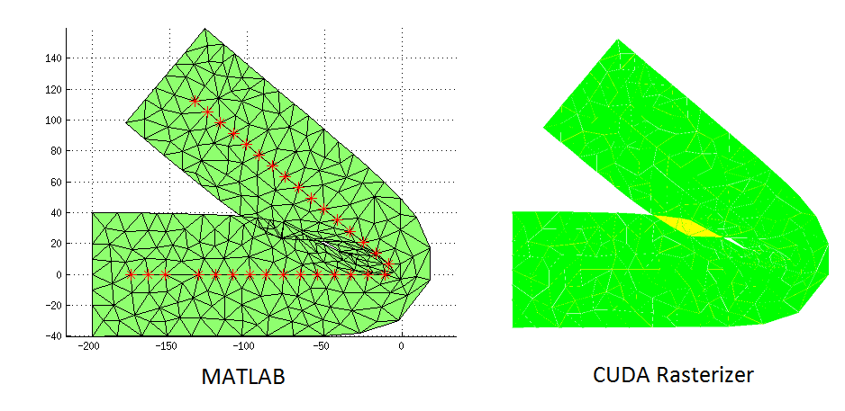

-------------------------------------------
CUDA (Massively Parallel) Software Rasterizer
-------------------------------------------
This rasterizer DOES NOT USE OPENGL to draw triangles! I am using CUDA to draw triangles and do shading FROM SCRATCH, in software! 

Video and full description available at http://lightspeedbanana.blogspot.com/2013/11/cuda-rasterizer.html.

Above, clockwise from upper left: Wireframe, Backfaces, Diffuse, Normals.

Above, Culling on vs. Culling Off

Above, performance on different models. 

Above, I used my rasterizer to visualize the rotation field in a deforming bar for my research with Dr. Kavan (http://www.seas.upenn.edu/~ladislav/). My rasterizer can render the finite-element discretization of the bar (center), and render the average rotation at each element (right).

For our research, it's important that we check for overlapping geometry. Above
is a comparison between the standard MATLAB plot and this rasterizer, visualizing overlapping bits. This is easy to do with a CUDA rasterizer, and tricky to do in MATLAB.

-------------------------------------------
USAGE/CAMERA
-------------------------------------------
1. Click and drag (camera move)
2. WASD (camera move)
3. Q and E (zoom in and out)
4. L (draw lines on top of shading)
5. H (toggle shading on and off)
6. C (toggle color interpolation on and off. This will average colors
at faces rather than interpolate them, IF we are using normals as a "hack"
to draw face colors).
7. T (toggle sampling step size. Larger step is faster, but produces artifacts.
Reason why is we need to sample tris below the Nyquist limit).
8. B toggle backface culling. 
9. Press 8 for 1984 mode (wireframe, green on black!)
10. Press K to write a yellow pixel to the buffer when two triangles are drawn
on top of each other. This works bets when we use a LARGER step (see #7) for
sampling.

-------------------------------------------
Credits
-------------------------------------------
Credits: 
1. Interactive camera is mostly based on my Pathtracer's interactive camera,
which is based on my CIS277 interactive camera.
2. Some commented out code is from some snippets from http://sol.gfxile.net/tri/index.html. The sort I did myself without looking at the code there. The gradient calculation I did steal (but that's basically the only way to calculate gradient, and it's also three lines). The pseudocode/algorithm description is what I did, but that's something I did myself, since a full implementation isn't on that blog post.
3. Got the line-drawing algorithm from CIS560 slides.
4. Base code from CIS565/Karl Li/Liam Boone.
