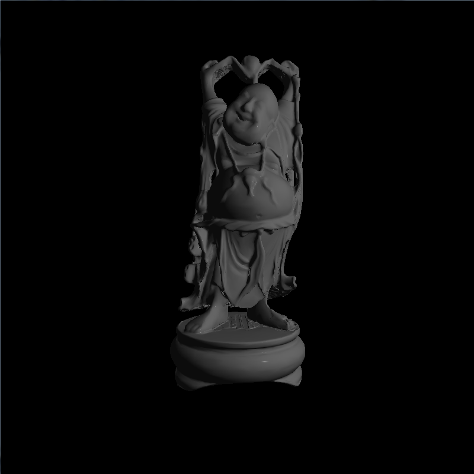
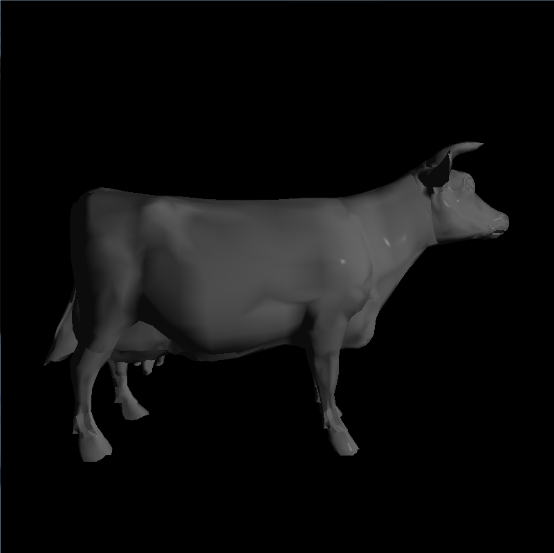
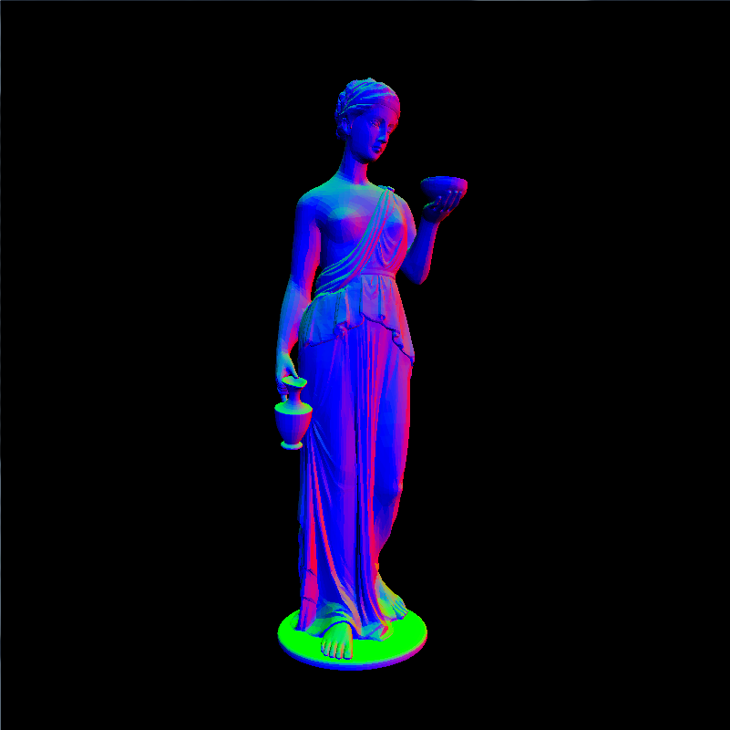
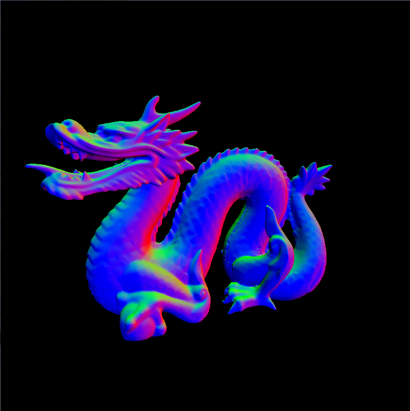
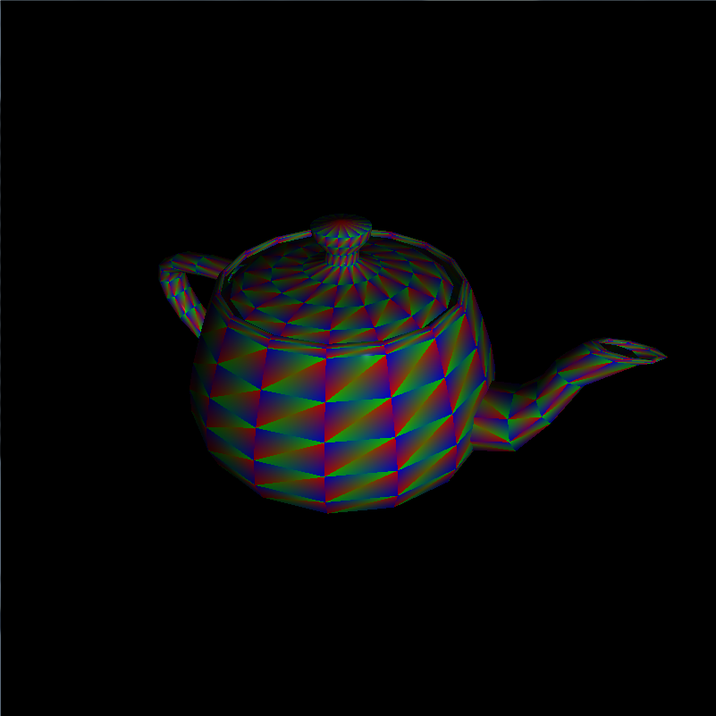

-------------------------------------------------------------------------------
CIS565: Project 4: CUDA Rasterizer
-------------------------------------------------------------------------------
Fall 2013
-------------------------------------------------------------------------------

FEATURES:
-------------------------------------------------------------------------------
This is a rasterizer without the help of OpenGL except PBOs. With vertex shader, primitive assembly, rasterization, and fragment shader completely writen in CUDA, the CUDA rasterizer can achieve 120-140fps for 100k triangles in an highend desktop.

Basic features:

* Fxied Function part of OpenGL pipeline, including
  * Vertex assembly
  * Perspective division, viewport transform
  * Primitive assembly with support for triangle VBOs/IBOs
  * Scanline rasterization
  * Early depth test in rasterization stage using atomic operation of depth buffer
* Programmable part of OpenGL pipeline, including
  * Vertex shader with model-view-perspective transformation
  * Fragment shader with support of Phone shading, normal shading and depth shading

Extra features:

* Super-sampled Antialiasing
* Backface culling during primitive assembly
* Color interpolation with Barycentric coordinates
* Mouse interaction:
  * Rotation around model: Move mouse cursor while holding left mouse button
  * Vertical panning: Move mouse cursor up and down while holding middle mouse button
  * Zoom-in/out: Mouse wheel

[Click here for project video](http://youtu.be/e5DsuHbJe00 )
 

-------------------------------------------------------------------------------
SCREENSHOTS:
-------------------------------------------------------------------------------

### Antialiasing (Original, 4 samples, 9 samples)

### Normal rendering

### Color Interpolation

-------------------------------------------------------------------------------
PROBLEMS ENCOUNTERED:
-------------------------------------------------------------------------------

-------------------------------------------------------------------------------
PERFORMANCE EVALUATION
-------------------------------------------------------------------------------
The performance evaluation is where you will investigate how to make your CUDA
programs more efficient using the skills you've learned in class. You must have
performed at least one experiment on your code to investigate the positive or
negative effects on performance. 

We encourage you to get creative with your tweaks. Consider places in your code
that could be considered bottlenecks and try to improve them. 

Each student should provide no more than a one page summary of their
optimizations along with tables and or graphs to visually explain any
performance differences.

