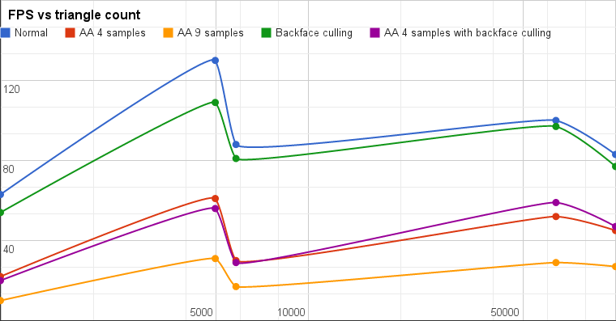

-------------------------------------------------------------------------------
CIS565: Project 4: CUDA Rasterizer
-------------------------------------------------------------------------------
Fall 2013
-------------------------------------------------------------------------------

FEATURES:
-------------------------------------------------------------------------------
This is a rasterizer without the help of OpenGL except PBOs. With vertex shader, primitive assembly, rasterization, and fragment shader completely writen in CUDA, the CUDA rasterizer can achieve 120-140fps for 100k triangles in an highend desktop.

Basic features:

* Fxied Function part of OpenGL pipeline, including
  * Vertex assembly
  * Perspective division, viewport transform
  * Primitive assembly with support for triangle VBOs/IBOs
  * Scanline rasterization
  * Early depth test in rasterization stage using atomic operation of depth buffer
* Programmable part of OpenGL pipeline, including
  * Vertex shader with model-view-perspective transformation
  * Fragment shader with support of Phone shading, normal shading and depth shading

Extra features:

* Super-sampled Antialiasing
* Backface culling during primitive assembly
* Color interpolation with Barycentric coordinates
* Interactive camera:
  * Rotation around model: Move mouse cursor while holding left mouse button
  * Vertical panning: Move mouse cursor up and down while holding middle mouse button
  * Zoom-in/out: Mouse wheel
  * Reset camera: space bar

[Click here for project video](http://youtu.be/e5DsuHbJe00 )
 

-------------------------------------------------------------------------------
SCREENSHOTS:
-------------------------------------------------------------------------------

### Antialiasing (Original, 4 samples, 9 samples)

### Normal rendering

### Color Interpolation

-------------------------------------------------------------------------------
PROBLEMS ENCOUNTERED:
-------------------------------------------------------------------------------

-------------------------------------------------------------------------------
PERFORMANCE EVALUATION
-------------------------------------------------------------------------------

