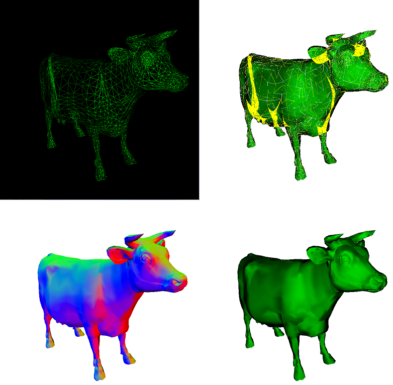

-------------------------------------------
CUDA (Massively Parallel) Software Rasterizer
-------------------------------------------

USAGE/Features:

1. Click and drag (camera move)
2. WASD (camera move)
3. Q and E (zoom in and out)
4. L (draw lines on top of shading)
5. H (toggle shading on and off)
6. C (toggle color interpolation on and off. This will average colors
at faces rather than interpolate them, IF we are using normals as a "hack"
to draw face colors).
7. T (toggle sampling step size. Larger step is faster, but produces artifacts.
Reason why is we need to sample tris below the Nyquist limit).
8. B toggle backface culling. 
9. Press 8 for 1984 mode (wireframe, green on black!)
10. Press K to write a yellow pixel to the buffer when two triangles are drawn
on top of each other. This works bets when we use a LARGER step (see #7) for
sampling.

Credits: 
0. Interactive camera is mostly based on my Pathtracer's interactive camera,
which is based on my CIS277 interactive camera.
1. Some commented out code is from some snippets from http://sol.gfxile.net/tri/index.html. The sort I did myself without looking at the code there. The gradient calculation I did steal (but that's basically the only way to calculate gradient, and it's also three lines). The pseudocode/algorithm description is what I did, but that's something I did myself, since a full implentation isn't on that blog post.
2. Got the line-drawing algorithm from Norm's slides
3. Base code from CIS565/Karl Li/Liam Boone

Known Issues:
Zooming the camera inside the body causes a crash.
