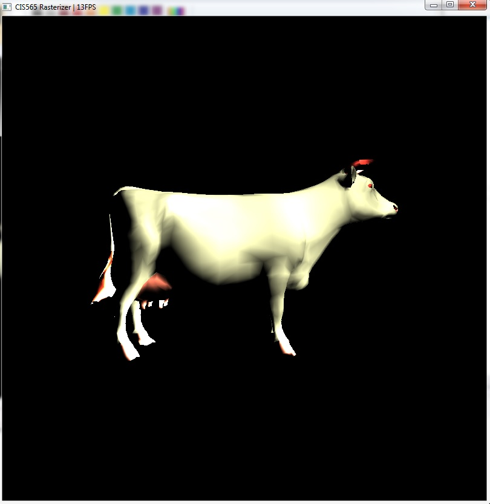
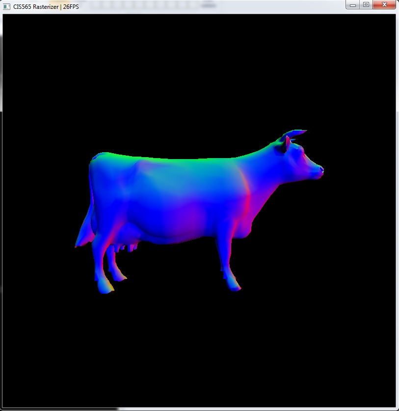
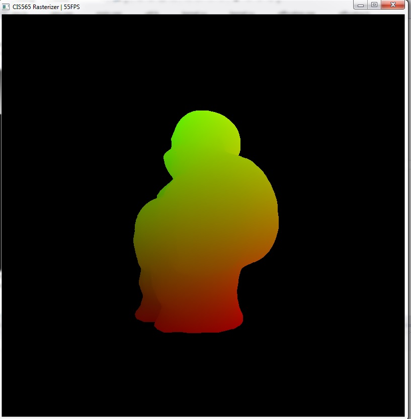
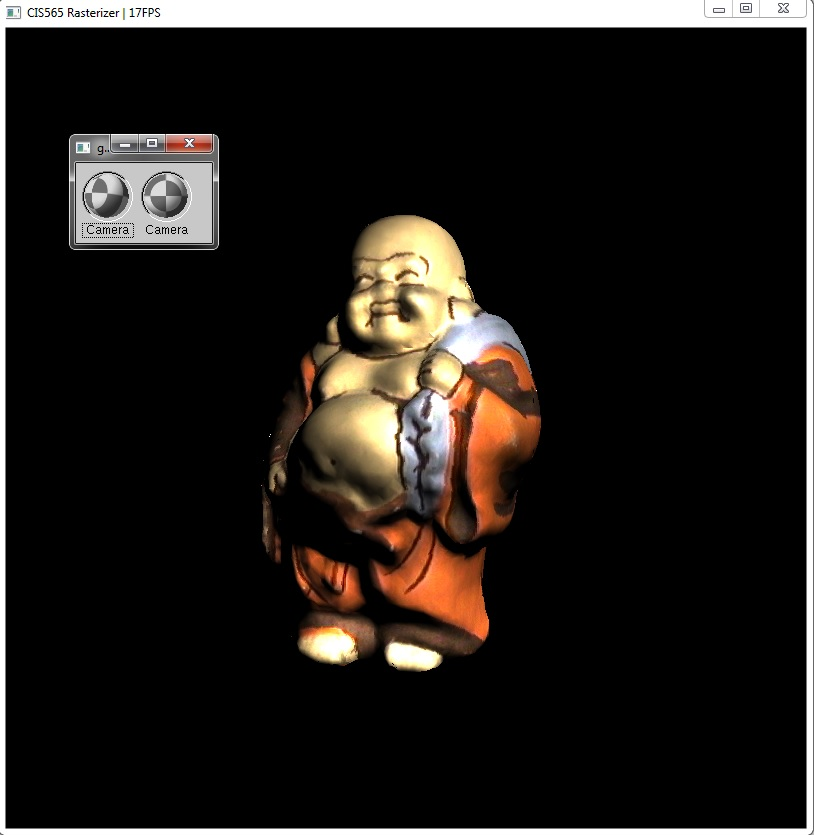
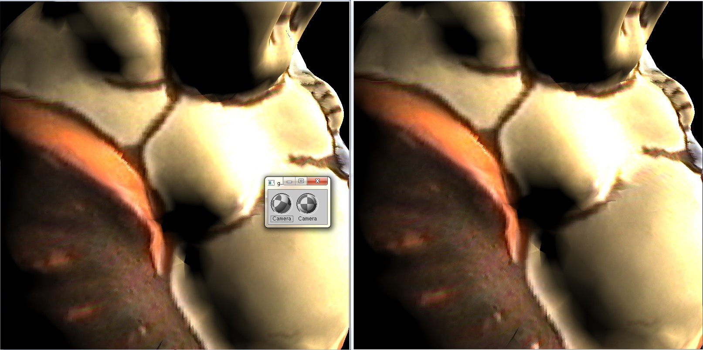
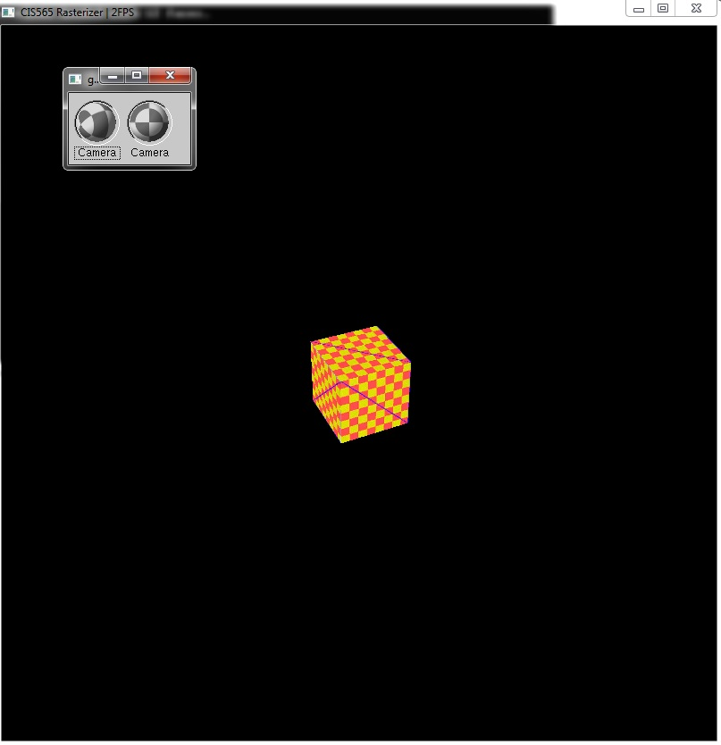
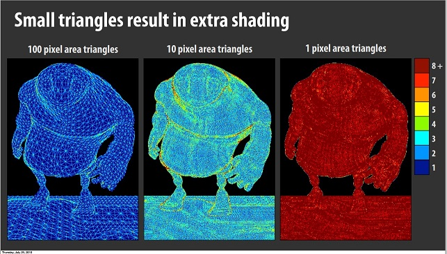

#CIS565: Project 4: CUDA Rasterizer
### This project implements a rasterizer and parts of graphics pipeline using CUDA. 
### The pipeline stage implemented:
 * Vertex Shader
 * Primitive Assembler
 * Rasterizer
 * Pixel Shader
 * With the follwoing features:  
 
   Perspective correct texture mapping with bilinear filtering  
   Interactive camera
### Implementation Details
 * Vertex shader is realized by a CUDA kernel function, its job is transforming input vertices into clipping space.
 * Primiive Assembler is also realized by a CUDA kernel function, which collects 3 vertices indicated by data in the index buffer and ouput a list a triangle primitives.  
 * Rasterizer is implemented as 2-stage process, that is, 2 CUDA kernel functions. The 1st kernel rasterizes the input triangles and performs depth test and
   updates the Z-buffer using atomicMin.  
   A Z-buffer with 64-bit depht is contructed. Each Z-buffer element packs a 32bit primtive ID and a 32bit depth value.  
   
   Depth comparison is peformed based on depht value, but the Z-buffer are updated by the whole 64bit combo.  
   
   At the 2nd kernel, at each pixel location, the primitve id closest to the camera can be retrieved from the higher 32 bits of the 64bit depht buffer, then brycentric interpolation is performed to obtain 
   interpolated attributes.  
   By this way, use of critical section is avoided.
 * Pixel shader
   Pixel shader is implemented by a CUDA kernel function. It calculates lighting effects using Bling-Phong shading model, and performs texture mapping with bilinear filtering.
   
## Result:  
  Lighting  
  
   
 
  Surface normal visualization  
  
   
   
   
 Texture coordinates visualization  
 
   
   
   
 Texture mapping plus lighting  
 
   
 
 [Left]nearest filtering; [Right]Bilinear filtering  (almost no difference, might be some bugs)
 
  
 
 The sample highlights perspective-correct texture mapping  
 
 
 
## Performance evaluation:
 * In this version of implementation, rasterization kernel is launched by primitives, thus GPU is under-utilized when the scene contains a few primitives spanning a lot of pixel locations.  
   In the current version, a scene with one triangle spanning over 50
 * For better scalability, tile-based rasterization might be a more ideal model. 
 * For scenes with primitives smaller than one pixel size, overdraw will occurs. Micropolygon rendering aims to alleviate the problem:
 
   see  http://bps10.idav.ucdavis.edu/talks/10-fatahalian_MicropolygonsRealTime_BPS_SIGGRAPH2010.pdf
    
  
   (Picture from  http://bps10.idav.ucdavis.edu/talks/10-fatahalian_MicropolygonsRealTime_BPS_SIGGRAPH2010.pdf)  
   
   The next stage of this projec will be implementing the micropolygon rendering pipeline.  
   
## Additional third-party libraries used
 * GLM OBJ model loader
 * GLUI library

   