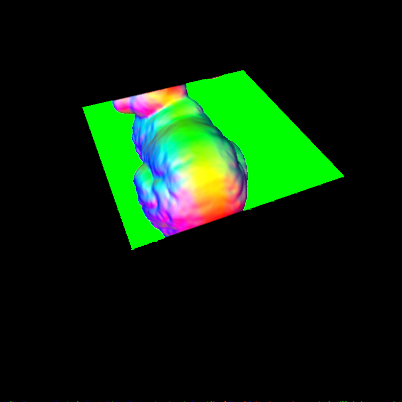

# CUDA Rasterizer #

Normal Color

Zdepth Color

Diffuse Color

Correct Color Interpolation

Stencil Test

**Description:**

In this rasterizer, I implemented the vertex shading, primitive assembly with support for triangle VBOs/IBOs, perspective transformation, rasterization using scanline method, fragment shading, depth buffer with race condition control and diffuse lighting.

In addition to this, I also implemented the stencil test, correct color interpolation, back face culling and a simple anti-aliasing

For loading the obj file, user can change filename in the main.cpp. In the obj folder, I already provided several different obj file for testing.

In addition, you can turn on or off back face culling and anti-aliasing in the rasterizeKernels.h file. In this file, you can find **#define BACKCULLING** and **#define ANTIALIASING**, you can set 1 for turn on and 0 for off.

For the stencil test, right now is just support two layer. For using the stencil test, you need to have a obj contains two different objects. For turn on the stencil test, you can go to main.h file to find **#define STENCIL**, set this value to 1 to turn on this feature. Also, you need to provide how many primitives in the first objects in **#define FIRST**. For testing purpose, I already provided a file name stencil.obj in obj folder, this file contains a plane and a Stanford bunny. The number of primitives in first object is two. Run the program, you will see the effect.

User can switch to three different display mode using keyborad. Press q is zdepth color display, w for normal map color display and e for diffuse color display.

**Performance:**

I did a performance test with and without back face culling. Turning on the back face culling, the speed increase about 1 fps.

I also did a performance with and without the stencil test and anti-aliasing.

Red color means the function is turning on, blue means turn off.

**Building Instruction:**

I am using cuda 2.0 for building this project because I use atomicCAS function for race condition control.

**Video:**

Video Link is here [http://www.youtube.com/watch?v=z8rvECD-jYY&feature=youtu.be](http://www.youtube.com/watch?v=z8rvECD-jYY&feature=youtu.be)

