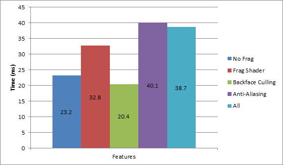

-------------------------------------------------------------------------------
CIS565: Project 4: CUDA Rasterizer
-------------------------------------------------------------------------------
Fall 2013
-------------------------------------------------------------------------------

-------------------------------------------------------------------------------
NOTE:
-------------------------------------------------------------------------------
NVidia Cards with compute 3.0 supported

---
Screenshots
---

*Diffuse Shading: 871k, 5k triangles*

*Depth Shading: 100k triangles*

*Normal Shading: 871k triangles*

*Color Per Triangle: 6k triangles*

*Color Per Vertex (interpolated Colors): 6k triangles*

--- 
Features
---

Extra Features Impemented:
* Point Mode: Render using only points. Key 'p' to switch on and off
* Mouse Interaction: use mouse to pan and zoom
* Correct Color Interpolation: Using barycentric coordinates to interpolate colors
* Back Face Culling: Using thrust to remove faces with normals point away from the eye
* Back Face Ignoring: After calculating fragment properties, do not perform depth test in rasterization stage
* Dynamic Parallelization: use compute 3.5 to launch a kernel from within a kernel

Basic features implemented:
* Vertex Shading: Vertex transformations
* Primitive Assembly: Takes normal and color buffers and arranges them
* Rasterization: Per primitive rasterization
* Depth Testing: At rasterization stage
* Fragment shader: for different lighting techniques

---
Atomics
---

I tried implementing locking by using a mutex per fragment (storing it in the fragment buffer itself), but for some reason, it seemed to always be going to a deadlock situation.

---
Performance Analysis
---

Note, that the total time is on the y axis of the left side.

One curious thing we realize is that this problem lends itself to dynamic parallelism since we don't want to write a loop over the pixels in the bounding box but rather do that parallely as well.

We notice that the per primitive rasterization stage is pixel bound. i.e., the limit depends on the screen-space size of the triangle being rasterized since we have one triangle per thread. We could potentially parallelize by thread per fragment in output fragment buffer but then we would be bound by the number of fragments in the scene instead.
Thus, this implementation works most efficiently if there are small triangles. One large triangle covering most of the space would be a bad case scenario where this implementation doesn't scale down well.

Some small optimizations that I ended up doing were the following:
* Ensuring that the bounding box of the triangle is clipped in the viewport space.
* Not rasterizing on the line in case the current primitive has been crossed twice. In the worst case, this doesn't offer any speed up, in the best case, this speeds up one thread by 2x.

None the less, because the above optimizations are divergent, the speedups do not linearly translate to lowering times.

Back face culling seems to be just a tad bit faster than back face ignoring, but a combination of the two gives us the best result.