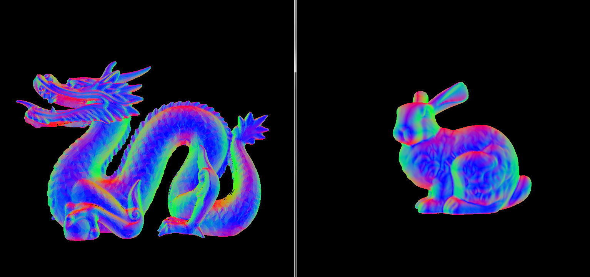

-------------------------------------------------------------------------------
CIS565: Project 4: CUDA Rasterizer
-------------------------------------------------------------------------------
Fall 2013
-------------------------------------------------------------------------------
Due Thursday 10/31/2012
-------------------------------------------------------------------------------
-------------------------------------------------------------------------------
INTRODUCTION:
-------------------------------------------------------------------------------
For this project, I implemented a GPU rasterizer that reads and rasterizes an .obj
file. The pipeline is as follows:

1. Transform the .obj vertices from model space to screen space using a series of 
matrix transformations. 

2. Do primitive assembly, i.e. take three vertices at a time and group them into 
triangles. Calculate normals (I keep them in camera space).

3. Rasterize per primitive -- for each primitive, find out which fragments it contains. 

4. Fragment shading -- Do diffuse shading for fragments that are contained by a primitive.

I implemented the following extra features:

* Color interpolation between points on a primitive

* Back-face culling -- I throw away all triangles that don't face the eye

* Mouse based interactive camera support

-------------------------------------------------------------------------------
Images:
-------------------------------------------------------------------------------
Normals

Color interpolation

Diffuse

Smooth normals

Specular

[Here](https://vimeo.com/78325264) is a video of the cow and the Stanford dragon
being rasterized. 

-------------------------------------------------------------------------------
PERFORMANCE EVALUATION
-------------------------------------------------------------------------------
Rasterizing per primitive VS per fragment

| Number of Faces  | Primitive parallel (FPS) | Fragment parallel (FPS) |
|------------------|--------------------------|-------------------------|
| Triangle (1)     |                       60 | 60                      |
| Cube (12)        |                       40 | 60                      |
| Cow (4853)       |                       60 | 4                       |
| Bunny (69630)    |                       30 | timed out               |
| Dragon (100,000) |                       12 | timed out               |

For meshes with bigger and fewer triangles, rasterizing by fragment proved to be 
more efficient than rasterizing by primitive. When meshes became more high-poly, 
the performance of primitive parallel rasterization increased drastically, while
fragment parallel rasterization's performance plumetted. In primitive parallel 
rasterization, the bounding box of the primitive can be calculated before entering
the loop that checks intersection per fragment. This saves a lot of time since a 
large percentage of fragments can be thrown out simply by doing one test. This 
property is extremely useful when meshes are dense (like the bunny and the dragon)
with triangles that fill up only a few fragments each. However, rasterizing using
the fragment parallel method is much slower for such meshes. Every fragment needs
to be tested against every primitive, and this becomes prohibitively expensive as
meshes denser. As shown above, the bunny and dragon models cannot be rasterized 
this way. 

Using backface culling

| Number of Faces  | Primitive parallel (FPS) | Fragment parallel (FPS) |
|------------------|--------------------------|-------------------------|
| Triangle (1)     | 121.18                   | 121.11                  |
| Cube (12)        | 5                        | 562.87                  |
| Cow (4853)       | 75.73                    | 81.56                   |
| Bunny (69630)    | 88.67                    | 102.03                  |
| Dragon (100,000) | 560.78                   | 687.83                  |

Backface culling provides a noticeable performance boost when there are a lot of 
primitives in the mesh, as expected. 
