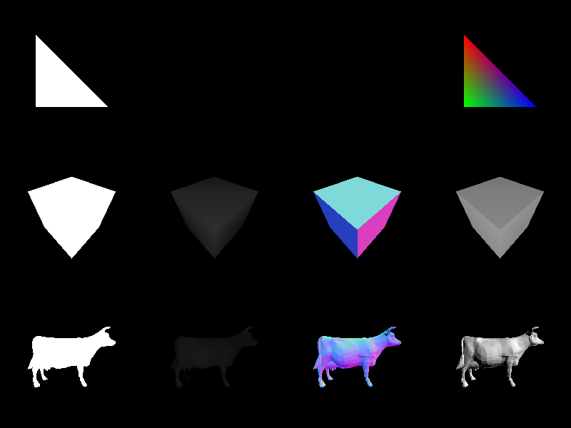
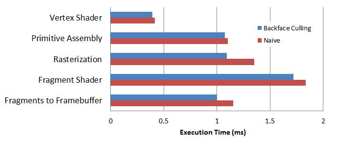

CUDA Rasterizer
===============

Performance Analysis
--------------------

###Execution Time Distribution

Since the rasterizer is parallelized over polygons, it takes majority of the computation time in rasterizing a single triangle (right).
On the other hand, the fragment shader starts to take more time to compute with more smaller polygons (left).
This matches what was was mentioned in class about how the fragment shader usually becomes the performance bottleneck in shaders.

Note: Fragment shader implements only Lambertian reflectance with single point light.

###Effectiveness of Backface Culling

Below shows execution time improvement after implementing backface culling (tested with cow model).
Performance benefit is greatest at rasterization since there are fewer polygons to process.

Note: This was for a class at UPenn: CIS565 Project 4 Fall 2013 (Due 10/31/2013)

