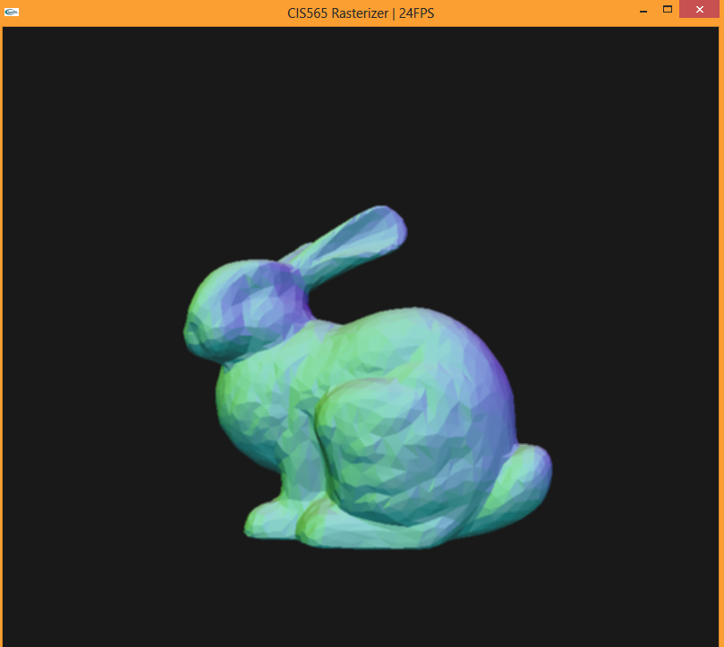
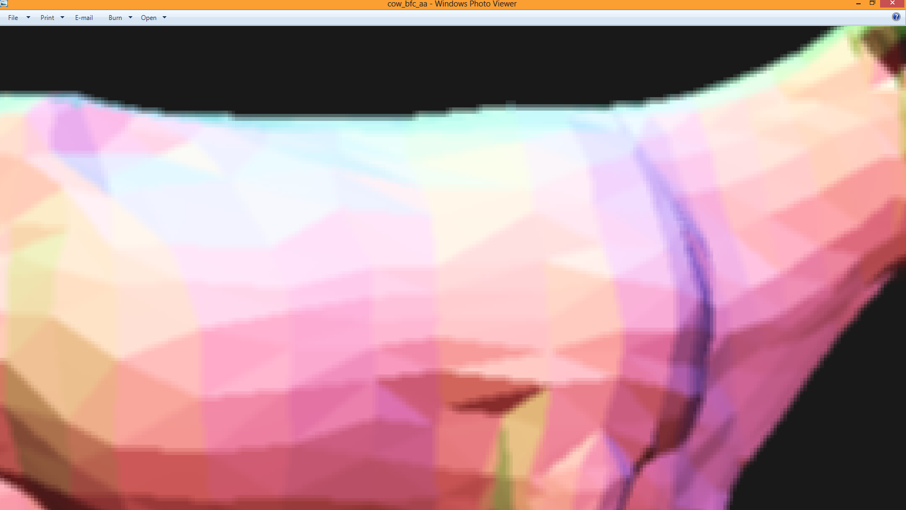

-------------------------------------------------------------------------------
CIS565: Project 4: CUDA Rasterizer
-------------------------------------------------------------------------------

-------------------------------------------------------------------------------
OVERVIEW:
-------------------------------------------------------------------------------
In this project, I implemented parts of the opengl rasterization pipeline in CUDA. Namely, vertex shader, 
vertex assembly with support for triangle VBOs/IBOs, perspective transformation, rasterization, fragment
shading, back-face culling, anti-aliasing, and mouse-based interactive camera.

The vertex shader kernel is responsible for converting all coordinates (positions and normals) into the desired coordinate
system (screen space or world space). Then, all information is passed to the vertex assembly kernel for constructing each
primitive. If back-face culling is enabled, then the primitives will be passed to the back-face culling kernel where faces that
are not facing the camera will be discarded. Next, the rasterization kernel will compute fragments colors, positions, and normals
based on barycentric coordinates of each primitive and write the result to the depth buffer. The depth buffer is then
passed to the fragment shader for simple lambertian shading. The results are then filled into the framebuffer and shown on screen.

[Video](http://youtu.be/VETewtqqOCI)

Anti-aliasing comparison:
Without anti-aliasing:

With anti-aliasing:

-------------------------------------------------------------------------------
PERFORMANCE EVALUATION
-------------------------------------------------------------------------------
For the performance analysis, I tested the average rendering time with or without certain features. Below is the running time comparsion

As expected, the lighting computation and the anti-aliasing step drastically increases the running time. In this test, I was using 4 light 
sources with the bunny obj file, which contains 4968 faces and 2503 vertices.

---
REFERENCES
---
[OpenGL Rendering Pipeline](http://www.songho.ca/opengl/gl_pipeline.html)

[OpenGL Transformation](http://www.songho.ca/opengl/gl_transform.html)

[OpenGL Projection Matrix](http://www.songho.ca/opengl/gl_projectionmatrix.html)

[The Viewport Transformation](http://glasnost.itcarlow.ie/~powerk/GeneralGraphicsNotes/projection/viewport_transformation.html)

[GLUT Camera Movement](http://www.lighthouse3d.com/tutorials/glut-tutorial/mouse-putting-it-all-together/)
